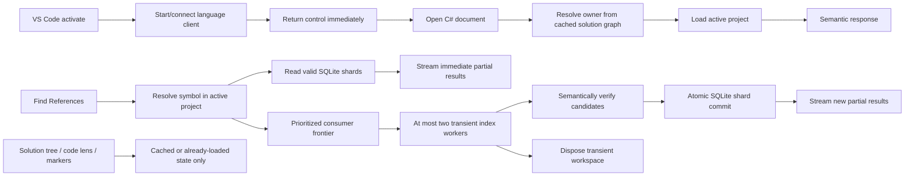

# Full Code Review and Project-Loading Performance Plan

Status: proposed implementation plan  
Scope: RoslynMCP server, shared host, LSP transport, VS Code extension, packaging, tests, and release validation  
Primary objective: make opening a C# file in VS Code feel immediate while keeping complete cross-project references fast and memory-bounded  
Baseline reviewed: current working tree, including the in-progress lazy Solution Explorer and large-solution test changes

## Executive summary

The current architecture lets work that is unrelated to the active editor enter the startup critical path. VS Code activation performs discovery before starting the client, the proxy touches a heavyweight `WorkspaceService` static initializer, the server eagerly performs database discovery and creates recursive file watchers, and several UI requests can load projects before the user asks for semantic results.

Once a project is needed, project ownership discovery, restore, MSBuild evaluation, workspace mutation, and compilation probing are serialized under a per-solution gate. Cross-project references then load consumer projects one at a time. This explains why the current 25-project stress scenario can take approximately 77 seconds.

The 77-second measurement is not solely "VS Code open time": the scenario also creates a fixture, starts the process, requests the solution tree and code lenses, loads a project, and deliberately searches references across consumers. It is still unacceptable. The plan therefore sets two separate budgets:

- The VS Code UI and active file become usable immediately, without loading the solution.
- A complete cold reference search across the restored 25-project fixture finishes in under 5 seconds.

The target design has three layers:

1. A minimal startup path that starts the language client and returns control to VS Code without solution discovery, prompting, compilation, database discovery, or project loading.
2. An interactive workspace that loads only the active file's project and uses metadata references for dependencies whenever possible.
3. A persistent per-solution SQLite index that returns cached references immediately, incrementally indexes invalid shards with at most two transient workers, streams partial results, and never expands the retained interactive workspace.

This is not a recommendation to preload all 25 projects into the main workspace. That would improve a benchmark while increasing startup cost and memory. Full-solution loading remains an explicit command-only path.

## Performance budgets

These budgets are release gates, not aspirational telemetry.

| Scenario | Budget | Measurement boundary |
|---|---:|---|
| Extension activation | < 100 ms | `activate()` entry to returning control to VS Code |
| Solution tree first paint, warm daemon | < 500 ms | view expansion to cached structural nodes displayed |
| Solution tree first paint, cold daemon | < 1.5 s | view expansion to cached/parsed structural nodes displayed |
| Active-file semantic readiness, restored repository | < 2 s | document open to first semantic response |
| Active-file semantic readiness, cold server process | < 5 s | document open to first semantic response |
| Cached references time to first result | < 250 ms | references request to first partial batch |
| Complete references, cold index, restored 25-project fixture | < 5 s | request to final result |
| Full 25-project end-to-end stress scenario | < 15 s | fixture-ready server scenario, excluding package restore/network |
| Background indexing concurrency | <= 2 workers | number of transient MSBuild workspaces |
| Interactive workspace growth caused by indexing | 0 projects | retained workspace project count before/after indexing |
| Persistent index size | <= 512 MB/solution by default | SQLite database plus WAL/SHM |

Package restore and network download time must be measured and reported separately. A missing SDK, inaccessible feed, or first-time package download must never be hidden inside a semantic-readiness metric.

## Desired user experience

When a folder or solution opens:

1. The extension activates and starts or connects to the daemon without scanning the repository or showing a modal selection prompt.
2. The solution tree appears from a cheap solution parse/cache. Expanding projects or dependencies does not load Roslyn projects.
3. Opening a C# file resolves its owning project from a cached solution graph and loads that project only.
4. Referenced projects are represented as metadata unless source is actually required or their output is unavailable/stale.
5. Code lens, inheritance markers, diagnostics, and tree decoration operate on already-loaded state; they do not start project loads.
6. Find References returns active/open-file and valid cached results first, then streams newly verified project shards.
7. Indexing continues at low priority with bounded memory and updates reference counts through a coalesced refresh.
8. An explicit "load full solution" operation may use one batch load, but normal editor activity never retains all projects merely to prepare for possible future requests.

## Target architecture



## Root-cause findings: startup and loading

### PERF-01 — The thin proxy triggers heavyweight workspace initialization

Priority: P0  
Impact: high startup latency before useful protocol work

`LspProxy` calls `WorkspaceService.BindSolution`, which causes the `WorkspaceService` static constructor to run. That static initialization patches binding redirects, registers MSBuild, initializes Roslyn types, and performs shadow-directory cleanup. MSBuild discovery can synchronously acquire/download `vswhere`. The real server process touches the service again, duplicating responsibility across proxy and host.

References:

- [`RoslynMCP/Lsp/LspProxy.cs`](../RoslynMCP/Lsp/LspProxy.cs), approximately lines 29-35
- [`RoslynMCP/Services/WorkspaceService.cs`](../RoslynMCP/Services/WorkspaceService.cs), approximately lines 120-173 and 193-295
- [`RoslynMCP/Program.cs`](../RoslynMCP/Program.cs), approximately lines 45-51
- [`RoslynMCP/Services/MsBuildLocator.cs`](../RoslynMCP/Services/MsBuildLocator.cs), approximately lines 39-93

Required change:

- Move solution binding into a lightweight holder with no dependency on `WorkspaceService`.
- Ensure the proxy only resolves the binding and connects/spawns the daemon.
- Acquire the daemon ownership lock before any heavy initialization.
- Move binding redirect patching and MSBuild registration into the actual server's lazy workspace bootstrap.
- Never synchronously download tooling during LSP startup. Package or pre-resolve it, or perform an explicit actionable failure path.

Acceptance:

- Constructing/running the proxy does not initialize `WorkspaceService`.
- A daemon connection can be established without MSBuild registration.
- Startup tracing proves no `vswhere` network/download path occurs before the first project request.

### PERF-02 — Database provider discovery runs before the host is ready

Priority: P0  
Impact: high on large repositories

`ToolHostServices` eagerly discovers a default database provider before the pipe becomes available. Discovery recursively scans directories to a depth of 32 even when no database tool is used.

References:

- [`RoslynMCP/Host/ToolHostServices.cs`](../RoslynMCP/Host/ToolHostServices.cs), approximately lines 19-22 and 57-65
- [`RoslynMCP/Services/Database/AutoConnectionStringDiscovery.cs`](../RoslynMCP/Services/Database/AutoConnectionStringDiscovery.cs), approximately lines 69-84 and 140-170

Required change:

- Replace eager provider creation with `Lazy<T>` or an async single-flight factory.
- Run discovery only on the first database command.
- Cache the result per solution root with explicit invalidation for relevant configuration files.
- Bound traversal by known configuration locations rather than a depth-32 repository walk.

Acceptance:

- No database discovery methods appear in an LSP startup trace unless a database feature is invoked.

### PERF-03 — Initialization creates excessive recursive watchers

Priority: P0  
Impact: high CPU, I/O, handles, and initialization latency

The LSP initialize path starts the designer bridge synchronously. Session initialization parses the solution and creates a recursive watcher per project directory. Overlapping project roots multiply events and OS watcher usage.

References:

- [`RoslynMCP/Lsp/LspServer.cs`](../RoslynMCP/Lsp/LspServer.cs), approximately lines 113-147
- [`RoslynMCP/Lsp/DesignerWatchBridge.cs`](../RoslynMCP/Lsp/DesignerWatchBridge.cs), approximately lines 37-64
- [`RoslynMCP/Services/Designers/SolutionSessionService.cs`](../RoslynMCP/Services/Designers/SolutionSessionService.cs), approximately lines 70-127

Required change:

- Do not start designer watchers synchronously inside initialize.
- Consolidate project directories into the smallest non-overlapping root set.
- Filter extensions and ignored directories before dispatch.
- Debounce and deduplicate events by canonical path.
- Start the bridge after initialization or on first designer use.

Acceptance:

- Initialization returns before watcher construction.
- A 25-project solution does not create 25 overlapping recursive watchers.

### PERF-04 — VS Code activation blocks on repository discovery and prompting

Priority: P0  
Impact: direct perceived startup regression

The extension awaits recursive solution/project discovery and can prompt the user before `LanguageClient.start()`. Activation is also broader than necessary.

References:

- [`vscode-extension/src/extension.ts`](../vscode-extension/src/extension.ts), approximately lines 153-229 and 2205-2258
- [`vscode-extension/package.json`](../vscode-extension/package.json), approximately lines 16-22

Required change:

- Make `activate()` register commands/providers, start the client, and return immediately.
- Remove recursive `workspace.findFiles` from the activation critical path.
- Never show a startup modal. Use the persisted binding, an unambiguous root-level solution, or a non-blocking status item.
- Narrow activation events to C# language usage, the RoslynSense view, and explicit commands where supported by the target VS Code version.
- Discover alternate solutions in the background and expose selection through an explicit command.

Acceptance:

- `activate()` meets the 100 ms budget in a large synthetic repository.
- No modal is shown merely by opening a folder.
- Client startup begins before recursive discovery.

### PERF-05 — Daemon probing adds fixed cold-start delay

Priority: P1  
Impact: medium fixed latency

The daemon spawner performs two 250 ms pipe probes around startup.

Reference:

- [`RoslynMCP/Host/DaemonSpawner.cs`](../RoslynMCP/Host/DaemonSpawner.cs), approximately lines 13-68

Required change:

- Use one ownership/mutex decision and one readiness signal.
- If another process owns startup, wait on the readiness signal instead of fixed probing.
- Record timings for connect, ownership acquisition, spawn, and ready.

Acceptance:

- No unconditional 250 ms sleep/probe remains in the cold path.

### PERF-06 — Explicit full-solution loading evaluates projects sequentially

Priority: P1  
Impact: high when the user explicitly requests preload

`OpenSolution` loops over projects and opens each `.csproj` independently. Each top-level `MSBuildWorkspace.OpenProjectAsync` can start its own build-host manager. This is the wrong implementation for an explicit batch load.

References:

- [`RoslynMCP/Tools/SolutionSessionTool.cs`](../RoslynMCP/Tools/SolutionSessionTool.cs), approximately lines 138-163
- [`RoslynMCP/Services/WorkspaceService.cs`](../RoslynMCP/Services/WorkspaceService.cs), approximately lines 494-504 and 683-687

Required change:

- Add a distinct `FullSolution` load intent.
- Implement explicit preload with one `MSBuildWorkspace.OpenSolutionAsync` call.
- Keep this path out of normal editor startup and reference indexing.
- Measure retained memory and make the command cancelable.

Acceptance:

- Explicit preload creates one workspace/build-host session.
- Interactive opening of one file does not enter this path.

### PERF-07 — Every project load forces a full compilation probe

Priority: P0  
Impact: high CPU and allocation cost

The post-open pipeline calls `GetCompilationAsync` for every newly opened project merely to test whether `System.Object` resolves.

Reference:

- [`RoslynMCP/Services/WorkspaceService.cs`](../RoslynMCP/Services/WorkspaceService.cs), approximately lines 1382-1405 and 1549-1584

Required change:

- Remove full compilation from the load-completion path.
- Validate framework references through evaluated metadata/reference information or a tiny standalone `CSharpCompilation` only when necessary.
- Treat framework-reference diagnostics as an explicit health check, not a prerequisite for workspace availability.

Acceptance:

- Loading a project without a semantic request does not call `Project.GetCompilationAsync`.

### PERF-08 — Solution ownership discovery performs I/O under the global cache lock

Priority: P0  
Impact: high contention and repeated solution parsing

Owner discovery scans/parses solution files while the workspace cache lock is held. An additional legacy/MSBuild scan computes a result that is not used.

References:

- [`RoslynMCP/Services/WorkspaceService.cs`](../RoslynMCP/Services/WorkspaceService.cs), approximately lines 349-394 and 1115-1138
- [`RoslynMCP/Utilities/PathHelper.cs`](../RoslynMCP/Utilities/PathHelper.cs), approximately lines 65-99, 127-133, and 187-217

Required change:

- Perform filesystem discovery and solution parsing outside the cache lock.
- Cache the solution graph by canonical solution path, file length, and last-write timestamp.
- Keep the lock only for atomic cache lookup/insertion.
- Delete the unused `RequiresMsBuild`/legacy scan or wire it to a documented decision.

Acceptance:

- No filesystem traversal or solution parsing occurs while the global cache lock is held.

### PERF-09 — Restore is serialized inside the project-load gate

Priority: P0  
Impact: high and potentially unbounded

When `project.assets.json` is absent, restore runs per project while holding the solution load gate. Other interactive requests wait behind process startup, network access, and package extraction.

Reference:

- [`RoslynMCP/Services/WorkspaceService.cs`](../RoslynMCP/Services/WorkspaceService.cs), approximately lines 664-717 and 1484-1543

Required change:

- Detect restore need before entering the workspace mutation gate.
- Deduplicate restore with an in-flight task keyed by solution/project restore target.
- Prefer one solution/static-graph restore where applicable.
- Add a restore state visible to the client so semantic requests can return a clear pending/failure result.
- Separate restore telemetry from project evaluation telemetry.

Acceptance:

- No external process or network-bound restore executes while holding the workspace mutation gate.
- Concurrent requests share one restore.

### PERF-10 — Fallback workspaces can overwrite correct solution mappings

Priority: P0  
Impact: duplicate work, stale ownership, and correctness risk

Fallback standalone-project loading unconditionally remaps a project closure. It can steal entries from the solution-owned workspace, fragmenting one logical solution across workspaces.

Reference:

- [`RoslynMCP/Services/WorkspaceService.cs`](../RoslynMCP/Services/WorkspaceService.cs), approximately lines 396-424 and 1058-1066

Required change:

- Never overwrite an existing authoritative solution mapping with a fallback mapping.
- Represent fallback ownership as explicitly degraded and replaceable.
- Reconcile fallback entries when the real solution workspace becomes available.
- Add invariants: one canonical project path has one authoritative owner; one document resolves consistently.

Acceptance:

- A fallback load cannot change ownership of a project already loaded through its solution.

### PERF-11 — File watchers are not scoped to the owning client/workspace

Priority: P1  
Impact: unnecessary invalidation across sessions

The extension creates unscoped watchers per client. Server-side project-shape changes can evict all workspaces globally.

References:

- [`vscode-extension/src/extension.ts`](../vscode-extension/src/extension.ts), approximately lines 371-415
- [`RoslynMCP/Lsp/Handlers/WatchedFilesHandler.cs`](../RoslynMCP/Lsp/Handlers/WatchedFilesHandler.cs), approximately lines 110-119

Required change:

- Use `RelativePattern(binding.folder, pattern)` for client watchers.
- Include/resolve session ownership on change notifications.
- Invalidate only the matching solution graph, project, and dependent reference shards.
- Coalesce project-shape event bursts.

Acceptance:

- Editing one solution's project file does not evict unrelated loaded solutions.

### PERF-12 — Solution parsing is synchronous and repeated

Priority: P1  
Impact: medium tree and navigation latency

`SolutionFileService` reparses the solution and blocks synchronously on repeated calls, including tree operations.

Reference:

- [`RoslynMCP/ProjectModel/SolutionFileService.cs`](../RoslynMCP/ProjectModel/SolutionFileService.cs), approximately lines 31-62

Required change:

- Cache parsed solution models by canonical path plus file fingerprint.
- Expose async APIs end to end.
- Invalidate precisely on solution-file changes.
- Share the parsed graph with owner resolution, tree rendering, and reference-frontier construction.

Acceptance:

- Repeated solution tree requests perform zero solution-file reparses when the file is unchanged.

### PERF-13 — Current benchmarks do not cover the production startup path

Priority: P0  
Impact: performance regressions can pass CI

The large-solution benchmark and stress fixture disable the shared host, bypassing proxy/daemon behavior. The opt-in benchmark's first 10-project restore failed after more than six minutes with no captured diagnostics, producing zero useful timings.

References:

- [`RoslynMCP.Tests/LargeSolutionBenchmarks.cs`](../RoslynMCP.Tests/LargeSolutionBenchmarks.cs), approximately lines 36-45 and 421-440
- [`RoslynMCP.Tests/LargeSolutionStressTests.cs`](../RoslynMCP.Tests/LargeSolutionStressTests.cs)
- [`RoslynMCP.Tests/Fixtures/LargeSolutionFixture.cs`](../RoslynMCP.Tests/Fixtures/LargeSolutionFixture.cs)

Required change:

- Add production-mode proxy/shared-host cases.
- Split fixture generation, restore, daemon startup, initialization, tree, active project, first reference batch, and final references into separately reported spans.
- Capture restore command, exit code, stdout, and stderr on failure.
- Restore the generated project/solution correctly before timed runs.
- Add hard assertions for the budgets in this document.
- Retain a no-shared-host microbenchmark only for component isolation.

Acceptance:

- CI produces non-empty timings or a diagnostic failure.
- At least one test exercises the exact packaged extension-to-proxy-to-daemon path.

### PERF-14 — Inheritance markers start expensive work immediately after client start

Priority: P1  
Impact: active-project loading and repeated symbol searches compete with startup

After `client.start()`, the extension requests inheritance markers. The server can perform one workspace load plus up to 50 downward `SymbolFinder` searches before the user asks for them.

References:

- [`vscode-extension/src/extension.ts`](../vscode-extension/src/extension.ts), approximately lines 472-480 and 878-955
- [`RoslynMCP/Lsp/Handlers/InheritanceMarkersHandler.cs`](../RoslynMCP/Lsp/Handlers/InheritanceMarkersHandler.cs), approximately lines 25-65

Required change:

- Request markers only for visible editor ranges and only after the active document is semantically ready.
- Cancel superseded requests on scroll/edit.
- Cache results by document version.
- Schedule downward searches at low priority with a strict time/result budget.

Acceptance:

- Starting a client with no visible C# editor performs no inheritance search.

### PERF-15 — File ownership classification loads projects

Priority: P0  
Impact: incidental requests become project loads

`FindContainingProjectAsync` opens candidate projects merely to determine which project owns a file. `LspDocumentResolver` makes this a common funnel.

References:

- [`RoslynMCP/Services/WorkspaceService.cs`](../RoslynMCP/Services/WorkspaceService.cs), approximately lines 725-772
- [`RoslynMCP/Lsp/LspDocumentResolver.cs`](../RoslynMCP/Lsp/LspDocumentResolver.cs), approximately lines 17-30

Required change:

- Resolve ownership from the cached solution/project graph and evaluated include patterns.
- Persist source-file-to-project mappings in the SQLite index/graph cache.
- If evaluation is required, evaluate project structure without adding it to the interactive workspace.
- Load only the selected owner after classification.

Acceptance:

- Asking which project owns a file loads at most the selected owner and never every candidate.

### PERF-16 — Solution Explorer dependency nodes can trigger project loading

Priority: P0  
Impact: browsing the tree changes workspace state and memory

The current lazy tree changes are directionally correct, but dependency-group expansion can still request generated documents and cause a project load.

Required change:

- Make all structural tree nodes use parsed solution data, cached project evaluation, or explicit `Prime` results only.
- Return an unloaded/refreshable placeholder when dependency metadata is unavailable.
- Never call generated-document or compilation APIs from tree enumeration.

Acceptance:

- Expanding every node in a 25-project tree does not increase the interactive Roslyn workspace project count.

### PERF-17 — Configured preload assumes one project load brings in the solution

Priority: P1  
Impact: configuration does not match behavior

The preload hosted service assumes opening the first project loads the whole solution, but the current implementation loads the seed plus forward references.

Reference:

- [`RoslynMCP/Host/WorkspacePreloadHostedService.cs`](../RoslynMCP/Host/WorkspacePreloadHostedService.cs), approximately lines 41-55

Required change:

- Define preload semantics explicitly: `None`, `ActiveProject`, or `FullSolution`.
- Route `FullSolution` to the batch `OpenSolutionAsync` path.
- Default to `None` for VS Code.
- Remove behavior based on accidental transitive loading.

Acceptance:

- Each preload mode has a test proving its exact retained project count.

## Root-cause findings: correctness, reliability, and maintainability

### GEN-001 — Release packaging can omit Windows debugger workers

Priority: P0  
Impact: shipped NuGet tool may be incomplete

Worker publish/copy targets require Windows, while release packing runs on Ubuntu. The resulting package can omit `win-x86` and `win-x64` debugger workers.

References:

- [`RoslynMCP/RoslynMCP.csproj`](../RoslynMCP/RoslynMCP.csproj), approximately lines 97-119
- [`.github/workflows/ci.yml`](../.github/workflows/ci.yml), approximately lines 88-150

Required change:

- Pack on Windows or explicitly cross-publish both worker RIDs before packing.
- Add a package-content assertion that opens the `.nupkg` and verifies required runtime assets.
- Smoke-test the installed tool from the produced package.

### GEN-002 — Workspace eviction can dispose an entry while it is in use

Priority: P0  
Impact: race, disposed workspace/gate, intermittent load failures

A cached entry is captured and used outside the cache lock. Concurrent eviction may dispose its workspace or load gate during incremental open.

Reference:

- [`RoslynMCP/Services/WorkspaceService.cs`](../RoslynMCP/Services/WorkspaceService.cs), approximately lines 369-401, 675-716, and 907-917

Required change:

- Add entry leases/refcounts.
- Mark entries retiring under the cache lock, reject new leases, and dispose only after active leases finish.
- Revalidate generation/identity before publishing mappings after async work.
- Add deterministic eviction-versus-open race tests.

### GEN-003 — Open document text/version is shared across client sessions

Priority: P0  
Impact: two editors can corrupt each other's document state

`OpenDocumentStore` keeps one text/version while tracking multiple owner sessions. Concurrent clients opening/editing the same path can overwrite each other.

Reference:

- [`RoslynMCP/Lsp/OpenDocumentStore.cs`](../RoslynMCP/Lsp/OpenDocumentStore.cs), approximately lines 16-23 and 57-82

Required change:

- Store text and version per session.
- Make snapshot selection session-aware.
- Define how MCP/non-LSP consumers choose a snapshot when multiple sessions are open.
- Reject out-of-order version updates per session.

### GEN-004 — Document close races with reopen

Priority: P0  
Impact: live document state can disappear

The store decides that the owner count reached zero, then removes the entry separately. A reopen between those operations can be deleted.

Reference:

- [`RoslynMCP/Lsp/OpenDocumentStore.cs`](../RoslynMCP/Lsp/OpenDocumentStore.cs), approximately lines 87-116

Required change:

- Make owner removal and zero-owner deletion one atomic operation.
- If using concurrent dictionary removal, remove conditionally by entry identity/generation.
- Add close/reopen race tests.

### GEN-005 — Diagnostic cancellation tokens and completed requests leak

Priority: P1  
Impact: growing resource use during editing

Linked cancellation sources are canceled but not consistently disposed, and completed pending entries can remain in the map.

Reference:

- [`RoslynMCP/Lsp/DiagnosticsPublisher.cs`](../RoslynMCP/Lsp/DiagnosticsPublisher.cs), approximately lines 37-45, 58-78, and 98-105

Required change:

- Remove a pending entry conditionally in `finally`.
- Dispose its linked token source exactly once.
- Add a churn test covering thousands of edits/cancellations.

### GEN-006 — Process registry trusts reusable PIDs

Priority: P0  
Impact: unrelated process can be considered live or killed

The running-process registry persists only a PID. PID reuse can cause an unrelated process to pass liveness checks or be terminated.

Reference:

- [`RoslynMCP/Services/Execution/RunningProcessRegistry.cs`](../RoslynMCP/Services/Execution/RunningProcessRegistry.cs), approximately lines 15-21 and 78-114

Required change:

- Persist process start time and a session-generated identity token with the PID.
- Validate all identity fields before reporting or killing a process.
- Treat access-denied/identity mismatch as stale ownership, never permission to kill.

### GEN-007 — Canceled app startup can leave orphan processes

Priority: P0  
Impact: process/resource leak

`AppRunService` registers the process before cancelable readiness and hot-reload setup. Cancellation/failure does not reliably terminate and unregister it.

Reference:

- [`RoslynMCP/Services/Execution/AppRunService.cs`](../RoslynMCP/Services/Execution/AppRunService.cs), approximately lines 84-125

Required change:

- Wrap post-start initialization in failure/cancellation cleanup.
- Kill only after validating process identity.
- Unregister and dispose session resources in `finally`/a dedicated ownership object.
- Add cancellation tests at each initialization boundary.

### GEN-008 — Solution tree edits permit path traversal

Priority: P0  
Impact: write outside intended project folder

User-provided item names can be rooted or contain `..`, allowing path escape from the selected parent.

Reference:

- [`RoslynMCP/Lsp/Handlers/SolutionTreeEditHandler.cs`](../RoslynMCP/Lsp/Handlers/SolutionTreeEditHandler.cs), approximately lines 76-87 and 123-132

Required change:

- Require exactly one valid file/directory-name segment.
- Reject rooted paths, separators, `.`/`..`, invalid characters, and reserved names.
- Resolve the final full path and verify containment beneath the canonical parent before writing.
- Add traversal tests for Windows and cross-platform separators.

### GEN-009 — Snippet capability is process-global instead of session-local

Priority: P1  
Impact: last initialized client changes responses for every client

Snippet support is stored in a static process-wide state.

References:

- [`RoslynMCP/Lsp/LspServer.cs`](../RoslynMCP/Lsp/LspServer.cs), approximately lines 117-122
- [`RoslynMCP/Lsp/LspClientState.cs`](../RoslynMCP/Lsp/LspClientState.cs)

Required change:

- Store client capabilities on the LSP session/context.
- Thread session capabilities into completion/result shaping.
- Add a two-client test with different snippet support.

### GEN-010 — Client readiness polling observes object existence, not running state

Priority: P1  
Impact: Test Explorer can initialize too early and remain empty

The extension polls every two seconds and treats the client object as ready before the language client reaches `State.Running`.

Reference:

- [`vscode-extension/src/clientReady.ts`](../vscode-extension/src/clientReady.ts), approximately lines 16-34

Required change:

- Subscribe to language-client state changes.
- Resolve readiness only at `State.Running`.
- Handle stop/restart and allow dependents to retry.
- Remove fixed polling.

### GEN-011 — VSIX packaging and CI can omit webview output

Priority: P1  
Impact: published extension can differ from locally tested sources

The package script invokes `vsce package`, the main TypeScript config excludes webview sources, the webview has a separate config, and CI does not build/inspect the final VSIX.

References:

- [`vscode-extension/package.json`](../vscode-extension/package.json), approximately lines 926-930
- [`vscode-extension/tsconfig.json`](../vscode-extension/tsconfig.json), approximately lines 13-16
- [`vscode-extension/tsconfig.webview.json`](../vscode-extension/tsconfig.webview.json), approximately lines 9-14
- [`.github/workflows/ci.yml`](../.github/workflows/ci.yml)

Required change:

- Add `vscode:prepublish` that compiles the extension and webview.
- Build the VSIX in CI, unpack it, and verify required JS/assets.
- Run a packaged-extension activation smoke test.

## Progressive reference-index design

### Why SQLite

The project already depends on `Microsoft.Data.Sqlite`, so the index does not require a new storage stack. SQLite WAL mode allows readers to continue while a writer appends changes, which fits concurrent reference reads plus one serialized index writer. Use WAL, `synchronous=NORMAL`, a busy timeout, and a single writer queue. See the official [SQLite write-ahead logging documentation](https://www.sqlite.org/wal.html).

Existing package references:

- [`RoslynMCP/RoslynMCP.csproj`](../RoslynMCP/RoslynMCP.csproj), `Microsoft.Data.Sqlite` around line 38
- [`RoslynMCP/RoslynMCP.csproj`](../RoslynMCP/RoslynMCP.csproj), direct SQLitePCLRaw pin around lines 55-56

### Storage location and lifecycle

Store indexes outside the repository under the OS local application-data folder:

```text
<LocalApplicationData>/RoslynSense/index/<SolutionHash>.db
```

Use the stable build-independent solution hash already provided by [`RoslynMCP/Host/HostPaths.cs`](../RoslynMCP/Host/HostPaths.cs), approximately lines 65-68. Do not use the daemon's temporary lock directory as persistent storage.

Rules:

- No source text or unsaved buffer content is persisted.
- Default maximum is 512 MB per solution.
- Prune least-recently-used reference shards before graph/file metadata.
- Delete and rebuild on unsupported schema version or integrity failure.
- Close connections cleanly but assume crash recovery through WAL.
- Provide an explicit `RoslynSense: Clear Reference Index` command.

### Proposed schema

```sql
CREATE TABLE metadata (
    key                 TEXT PRIMARY KEY,
    value               TEXT NOT NULL
);

CREATE TABLE projects (
    project_id          INTEGER PRIMARY KEY,
    path                TEXT NOT NULL UNIQUE,
    graph_fingerprint   BLOB NOT NULL,
    last_indexed_utc    INTEGER
);

CREATE TABLE project_edges (
    from_project_id     INTEGER NOT NULL,
    to_project_id       INTEGER NOT NULL,
    PRIMARY KEY (from_project_id, to_project_id)
);

CREATE TABLE files (
    file_id             INTEGER PRIMARY KEY,
    project_id          INTEGER NOT NULL,
    path                TEXT NOT NULL UNIQUE,
    checksum            BLOB NOT NULL,
    mtime_utc           INTEGER NOT NULL,
    length              INTEGER NOT NULL
);

CREATE TABLE file_identifiers (
    file_id             INTEGER NOT NULL,
    identifier_hash     INTEGER NOT NULL,
    PRIMARY KEY (file_id, identifier_hash)
);

CREATE TABLE symbols (
    symbol_id           INTEGER PRIMARY KEY,
    project_or_assembly TEXT NOT NULL,
    documentation_id    TEXT NOT NULL,
    kind                INTEGER NOT NULL,
    UNIQUE (project_or_assembly, documentation_id, kind)
);

CREATE TABLE reference_shards (
    symbol_id           INTEGER NOT NULL,
    project_id          INTEGER NOT NULL,
    project_fingerprint BLOB NOT NULL,
    complete            INTEGER NOT NULL,
    indexed_at_utc      INTEGER NOT NULL,
    last_accessed_utc   INTEGER NOT NULL,
    PRIMARY KEY (symbol_id, project_id)
);

CREATE TABLE "references" (
    symbol_id           INTEGER NOT NULL,
    project_id          INTEGER NOT NULL,
    file_id             INTEGER NOT NULL,
    start_offset        INTEGER NOT NULL,
    length              INTEGER NOT NULL,
    is_definition       INTEGER NOT NULL,
    PRIMARY KEY (symbol_id, file_id, start_offset, length)
);
```

Also add indexes for reverse project edges, `file_identifiers.identifier_hash`, reference lookup by symbol/project, and LRU shard pruning.

### Identity and correctness rules

- Persist only symbols with stable documentation comment IDs and a stable project/assembly identity.
- Keep locals, anonymous symbols, and other unstable symbols in live-memory results only.
- Identifier hashes are candidate filters, never final answers. Hash collisions can broaden work but cannot create returned false positives.
- Every returned uncached candidate must pass Roslyn semantic verification.
- Open unsaved buffers always supersede disk/cache results for that session.
- Deduplicate locations from cache, live workspace, and streamed shards by canonical path and span.

### Reference request algorithm

1. Resolve the symbol in the active project.
2. Search open documents and the already-loaded interactive project.
3. Read valid SQLite shards and emit them immediately.
4. Build a reverse-dependency frontier from the cached project graph.
5. Filter candidate files/projects with the identifier index.
6. Traverse direct consumers before transitive consumers.
7. Load candidates with at most two transient `MSBuildWorkspace` workers using `LoadMetadataForReferencedProjects = true`.
8. Semantically verify references in one project shard.
9. Commit the complete shard atomically through the single SQLite writer.
10. Stream the new locations and dispose/reset the transient workspace before taking more work.
11. Coalesce `workspace/codeLens/refresh` notifications so visible counts update without a refresh storm.

The standard LSP references request supports `partialResultToken` through `PartialResultParams`, and the partial payload is `Location[]`. Implement `$/progress` rather than a proprietary protocol. See the official [LSP 3.18 references specification](https://raw.githubusercontent.com/microsoft/language-server-protocol/gh-pages/_specifications/lsp/3.18/language/references.md).

Clients that do not send `partialResultToken` receive the collected final array and still benefit from the cache and bounded workers.

### Invalidation

| Change | Invalidation |
|---|---|
| Open unsaved edit | Session-local live overlay only; do not persist |
| Saved source file | File identifiers and every shard containing that file/project |
| Added/removed/renamed source file | Owning project's file map, identifier rows, and shards |
| `.csproj`, imported props/targets, lock/assets change | Project fingerprint, evaluation cache, and project shards |
| Project-reference change | Graph plus affected reverse-dependent shard frontier |
| `.sln` change | Parsed graph and ownership map; preserve only shards whose fingerprints remain valid |
| Schema/index version change | Rebuild database |
| Corruption/integrity failure | Quarantine/delete and rebuild; never fail the editor request |

### Scheduling and memory policy

- One serialized SQLite writer using `Channel<T>`.
- At most two transient index workers by default; make internal tuning possible but do not expose it initially.
- Do not start a new shard while interactive semantic work is queued/running.
- A canceled request unsubscribes from progress immediately. Safe shard computation already in flight may finish and commit for future requests.
- Dispose each transient workspace after its shard/batch; do not add projects to the main workspace.
- Use bounded queues and drop/recompute low-priority speculative work instead of retaining unbounded compilations.
- Record current/max worker count, workspace count, managed memory, cache hit rate, shard duration, and queue wait.

## Interactive workspace redesign

Introduce an internal load intent:

```csharp
internal enum WorkspaceLoadIntent
{
    Interactive,
    ExplicitProject,
    FullSolution
}
```

Behavior:

- `Interactive`: load the owning project only, prefer metadata for references, and load source dependencies only when their output is missing/stale or navigation explicitly crosses into them.
- `ExplicitProject`: load exactly the requested project with documented dependency semantics.
- `FullSolution`: use one `OpenSolutionAsync`; command-only and cancelable.

Implementation requirements:

- Set `LoadMetadataForReferencedProjects = true` for interactive and indexing workspaces.
- Separate owner discovery, restore, evaluation, workspace mutation, and post-load diagnostics into independently timed stages.
- Keep external process work outside locks/gates.
- Add single-flight tasks for graph parsing, restore, and project open.
- Replace disposable cache entries with leased entries and retirement.
- Keep the fallback workspace explicitly degraded and non-authoritative.
- Never force compilation solely to declare a project loaded.

## LSP and extension API changes

### Protocol

Extend the current reference parameters in [`RoslynMCP/Lsp/Protocol/Symbols.cs`](../RoslynMCP/Lsp/Protocol/Symbols.cs) with optional standard progress tokens:

```csharp
[JsonPropertyName("workDoneToken")]
public ProgressToken? WorkDoneToken { get; init; }

[JsonPropertyName("partialResultToken")]
public ProgressToken? PartialResultToken { get; init; }
```

Update [`RoslynMCP/Lsp/Handlers/NavigationHandlers.cs`](../RoslynMCP/Lsp/Handlers/NavigationHandlers.cs), approximately lines 182-267, to:

- Return loaded/cache results first.
- Report `Location[]` partial batches via `$/progress`.
- Avoid the current sequential `LoadConsumersAsync` path in [`RoslynMCP/Services/ProtoReferenceService.cs`](../RoslynMCP/Services/ProtoReferenceService.cs), approximately lines 668-845.
- Preserve final complete responses and cancellation semantics.

### Configuration and commands

Add:

```json
{
  "roslynSense.index.enabled": true,
  "roslynSense.index.maxSizeMb": 512
}
```

Add command:

```text
roslynSense.clearIndex
```

Do not add a custom wire-level index status protocol initially. Use standard work-done/partial-result progress and existing VS Code status UI.

## Implementation sequence

### Phase 0 — Make measurements trustworthy

1. Repair fixture restore and diagnostic capture.
2. Add production shared-host benchmark cases.
3. Add stage timing and retained-memory/project-count metrics.
4. Record current baselines for 1, 10, 25, and 50 projects.
5. Put the budgets in CI with a controlled runner or a non-flaky regression threshold plus a scheduled hard-budget job.

Exit criteria:

- The 25-project test consistently reports every stage.
- A failure identifies whether time was fixture creation, restore, spawn, initialize, evaluation, compilation, or reference search.

### Phase 1 — Remove work from VS Code startup

1. Make solution binding proxy-safe and lazy.
2. Defer database discovery.
3. Return from extension activation immediately.
4. Remove startup prompts and recursive discovery.
5. Defer/consolidate designer watchers.
6. Replace readiness polling with client state events.
7. Defer inheritance markers and other semantic decorations.

Exit criteria:

- Activation, cold tree, and no-visible-editor startup budgets pass.
- Startup performs no project load, compilation, restore, DB scan, or inheritance search.

### Phase 2 — Make active-file loading bounded

1. Cache the parsed solution graph.
2. Resolve file ownership without opening candidate projects.
3. Introduce load intents and metadata-first interactive loading.
4. Move restore outside workspace gates and deduplicate it.
5. Remove compilation probing.
6. Add entry leases and correct fallback ownership.
7. Make the Solution Explorer entirely cache-only.

Exit criteria:

- Opening a file loads one source project in the common restored case.
- Active semantic readiness meets the 2-second restored budget.
- Tree expansion does not change workspace project count.

### Phase 3 — Add the SQLite graph and file index

1. Add index path/version/database lifecycle.
2. Persist project graph, file fingerprints, and identifier hashes.
3. Add precise watcher-driven invalidation.
4. Add one serialized WAL writer and concurrent readers.
5. Add size accounting, LRU pruning, clear command, corruption recovery, and telemetry.

Exit criteria:

- A restart reuses a valid graph/file index.
- No source or unsaved text exists in the database.
- Concurrent read/write and corruption tests pass.

### Phase 4 — Add progressive reference shards

1. Extend `ReferenceParams` with standard progress tokens.
2. Return active/cache results first.
3. Implement prioritized reverse-dependency traversal.
4. Add at most two transient semantic index workers.
5. Atomically commit complete project shards.
6. Stream batches and coalesce code-lens refreshes.
7. Preserve full-array fallback for clients without partial results.

Exit criteria:

- Cached first result is under 250 ms.
- Cold complete 25-project references are under 5 seconds.
- Indexing adds zero projects to the retained interactive workspace.

### Phase 5 — Correctness and release hardening

1. Fix workspace eviction lifetime races.
2. Make open-document state session-local and atomic.
3. Fix diagnostic cancellation cleanup.
4. Strengthen process identity and startup cleanup.
5. Reject solution-tree path traversal.
6. Make client capabilities session-local.
7. Verify debugger workers and webview assets inside produced packages.

Exit criteria:

- All P0 correctness/security findings have regression tests.
- Installed NuGet tool and VSIX smoke tests pass on release artifacts.

## Test plan

### Unit tests

- Solution graph cache hit, timestamp/fingerprint invalidation, canonical path behavior.
- File ownership resolution without workspace load.
- Load-intent behavior and retained project counts.
- Restore single-flight success, failure, cancellation, and retry.
- Workspace entry acquire/retire/dispose races.
- Fallback mapping cannot overwrite authoritative ownership.
- SQLite migration, WAL readers/writer, atomic shard replacement, pruning, corruption recovery.
- Stable symbol identity; unstable/local symbols are not persisted.
- Identifier-hash collision produces extra verification but no false reference.
- Source/project/solution invalidation matrix.
- Per-session open text/version and out-of-order updates.
- Atomic close/reopen race.
- Diagnostic pending-map and CTS cleanup.
- PID plus start-time identity validation.
- App startup cancellation cleanup.
- Tree-edit path containment and traversal rejection.
- Per-session snippet capabilities.
- Client readiness transitions and restart.

### Integration tests

- Extension activation returns before discovery completes.
- Proxy connects without constructing the workspace service.
- Initialize does not create project workspaces or designer watcher fan-out.
- Opening one file in a 25-project solution loads one source project.
- Solution tree and dependency expansion remain load-free.
- Code lens with unloaded consumers does not load consumers.
- References streams cached/active locations before new shards.
- Clients without partial-result support receive one complete response.
- Unsaved session text supersedes cached disk results.
- Cancellation stops progress delivery and bounds background work.
- Editing one solution does not evict another solution.
- Explicit full preload uses one solution workspace.
- Index survives restart and invalidates only changed shards.

### Performance tests

Test at 1, 10, 25, and 50 projects with:

- warm daemon/warm index;
- cold daemon/warm index;
- cold daemon/cold index with restored packages;
- changed leaf project;
- changed central dependency;
- cache corruption/rebuild;
- multiple simultaneous clients;
- memory pressure and repeated reference searches.

Capture:

- extension activation;
- daemon connect/spawn/ready;
- initialize response;
- solution parse/cache;
- first tree paint;
- owner resolution;
- restore detection and restore separately;
- MSBuild evaluation/open;
- first semantic response;
- reference time to first batch and completion;
- cache hit/miss and invalidation reason;
- project/workspace/build-host counts;
- managed memory, working set, database/WAL size;
- worker queue wait and shard duration.

### Race and soak tests

- Open/evict the same solution repeatedly under concurrent requests.
- Open/edit/close/reopen the same file from two sessions.
- Save project/source files while reference shards commit.
- Cancel requests during restore, project open, semantic search, and SQLite commit.
- Run continuous edits/diagnostics for at least one hour and assert stable pending-map/token counts.
- Repeatedly start/cancel app processes and assert no orphans.

### Package tests

- Inspect `.nupkg` for both Windows debugger worker RIDs.
- Install and launch the tool from the produced `.nupkg`.
- Build and unpack VSIX; verify main extension and webview outputs.
- Launch an Extension Development Host from the packaged VSIX and verify activation/client readiness.

## Observability

Use structured spans with a shared request/session/solution correlation ID. At minimum:

- `extension.activate`
- `client.start`
- `daemon.connect`
- `daemon.spawn`
- `server.initialize`
- `solution.parse`
- `owner.resolve`
- `restore.detect`
- `restore.run`
- `project.evaluate`
- `project.open`
- `semantic.first_response`
- `references.cache_read`
- `references.live_search`
- `index.queue_wait`
- `index.project_shard`
- `index.commit`
- `references.first_partial`
- `references.complete`

Every span should record outcome and duration. Project/reference spans should also record project count, loaded-project count, cache state, worker count, and cancellation. Never log source text, connection strings, or unsaved buffer contents.

## Current changes to retain and finish

The working tree already contains useful movement in the intended direction:

- cache-only/lazy Solution Explorer evaluation through `TryGetCached`/`Prime`;
- proto code-lens behavior that avoids incidental consumer loading;
- large-solution fixture, stress, and benchmark scaffolding;
- diagnostic counters and client readiness work.

Before merging those changes:

- remove the remaining generated-document load from dependency-tree enumeration;
- replace client readiness polling with state events;
- add production shared-host benchmark coverage;
- repair benchmark restore and failure output;
- replace sequential explicit proto consumer loading with the progressive index path;
- correct the preload assumption.

## Definition of done

The project-loading initiative is complete only when all of the following are true:

- Opening VS Code does not scan/load/restore/compile a solution before editor demand.
- Opening a C# file makes its semantic features ready within the stated budget.
- Incidental UI features never load projects.
- Complete restored 25-project references finish in under 5 seconds, with cached results appearing in under 250 ms.
- Background indexing is bounded to two transient workers and does not grow the retained interactive workspace.
- Cache invalidation is precise, unsaved text stays session-local, and stale/corrupt indexes degrade safely.
- The 77-second stress scenario is below 15 seconds and reports stage timings.
- P0 lifecycle, path traversal, process identity, document-session, packaging, and workspace-race findings are fixed with regression tests.
- CI validates actual `.nupkg` and `.vsix` contents and runs a packaged startup smoke test.
- Performance traces and failures distinguish environmental restore/network costs from RoslynMCP costs.

## Priority order

1. Fix the benchmark so every subsequent change has trustworthy numbers.
2. Remove heavyweight work from proxy/server/extension startup.
3. Make ownership resolution and active-project load bounded and metadata-first.
4. Remove restore and compilation from serialized load completion.
5. Add workspace lifetime/fallback correctness before increasing concurrency.
6. Build the SQLite graph/file index.
7. Implement progressive, bounded reference shards.
8. Close remaining concurrency, security, packaging, and session-isolation findings.

This order should be followed. Adding concurrency to the current workspace cache before fixing entry lifetime and fallback ownership would make existing races harder to reproduce and more damaging.
